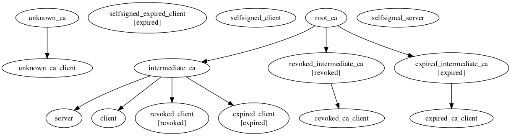

# ssl_testing
Certificates generation for testing. Suite generates normal, expired and revoked certificates.

## to generate certificates run
      make [OCSP=true]
     
## generation results


## CRL distribution point:
to start CRL distribution points for all the generated CA certificates you can use the next command:

    python -m SimpleHTTPServer # run from the root repo directory
    
## OCSP server
to start  OCSP server for CA authority you can use **start_ocsp_server.sh** tool:

    tools/start_ocsp_server.sh certificates/root_ca
    
## certificate validation
to verify certificate you can use **verify_cert.sh** tool, for example:
```
tools/verify_cert.sh certificates/expired_intermediate_ca
tools/verify_cert.sh --ocsp certificates/revoked_intermediate_ca
tools/verify_cert.sh --crl certificates/revoked_ca_client
tools/verify_cert.sh --crl_file certificates/intermediate_ca/crl/crl.pem certificates/revoked_client
```

## what have changed comparing to master branch

* no **FakeTimeCmd** - expired certificates generated with **-startdate** and **-enddate** parameters
* no generation of **selfsigned_expired_client** certificate
* no pkcs12 certificates generation
* added id-on-xmppAddr & DNS fields to client/server certificates

## how to test **cert_utils** module
```erlang
LoadCert = fun(PemFile) ->
  {ok, PemBin} = file:read_file(PemFile),
  [{'Certificate', DerBin, not_encrypted}|_] = public_key:pem_decode(PemBin),
  public_key:pkix_decode_cert(DerBin,plain)
end.

%c(cert_utils).
l(cert_utils).

CertDir="/git/ssl_testing/certificates/".

[ begin
    Cert = LoadCert(CertDir ++ C ++ "/certs/cert.pem"),
    CommonName    = cert_utils:get_common_name(Cert),
    CertDomains   = cert_utils:get_cert_domains(Cert),
    DNSAddresses  = cert_utils:get_dns_addresses(Cert),
    XMPPAddresses = cert_utils:get_xmpp_addresses(Cert),
    io:format("~n~p~n~30c~n~p~n~p~n~p~n~p~n~30c~n~n", [
        C, $- ,CommonName, XMPPAddresses,
        DNSAddresses, CertDomains, $=])
  end || C <- ["client","server","root_ca"]].
```
