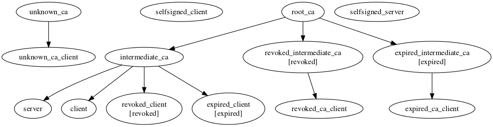

# ssl_testing
Certificates generation for testing. Suite generates normal, expired and revoked certificates.

## to generate certificates run
      make [OCSP=true] [FakeTimeCmd=<your command>]
     
## generation results


## CRL distribution point:
to start CRL distribution points for all the generated CA certificates you can use the next command:

    python -m SimpleHTTPServer # run from the root repo directory
## OCSP server

to start  OCSP server for CA authority you can use **start_ocsp_server.sh** tool:

    tools/start_ocsp_server.sh certificates/root_ca
## certificate validation
to verify certificate you can use **verify_cert.sh** tool, for example:
```
tools/verify_cert.sh certificates/expired_intermediate_ca
tools/verify_cert.sh --ocsp certificates/revoked_intermediate_ca
tools/verify_cert.sh --crl certificates/revoked_ca_client
tools/verify_cert.sh --crl_file certificates/intermediate_ca/crl/crl.pem certificates/revoked_client
```
## FakeTimeCmd

by default **FakeTimeCmd** is set to **datefudge "-180days"** but you can use **faketime** utility instead.

there are 2 reasons why we need to fake system time during certificates generation process:
1) When supplied with **-chain** option, **openssl pkcs12** tool verifies certificate and its CA chain. If any certificate is expired or not valid yet, tool fails with one of these errors:
   * "**Error certificate is not yet valid getting chain.**"
   * "**Error certificate has expired getting chain.**"
  
   So to generate expired pkcs12 certificate we need to make **openssl pkcs12** tool think that it's valid one, as well as all the CA certificates in the chain.
2) Also **openssl ca** tool supports **-startdate** and **-enddate** parameters to control start/end date of the issued certificate, while **openssl req** (used for self-singed certificates generation) supports only **-days** parameter to control the length of certificate's validity.

so generation of expired certificates is done in the next way:
1) the system time shifted 180 days backward
2) all the certificates and CRLs are issued for 365 days, except these 3 certificates:
   * expired_client
   * expired_intermediate_client
   * selfsigned_expired_client
   
   they are valid for 90 days only.
